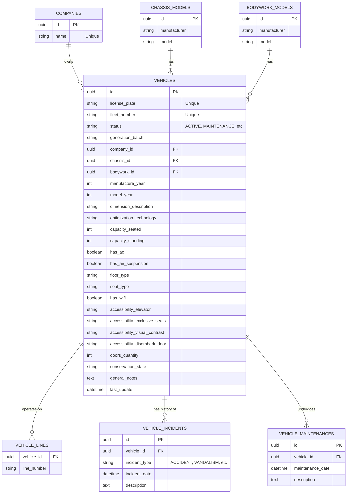

# Diagrama do Banco de Dados: Repositório de Ônibus

Abaixo está a representação visual (Entity-Relationship Diagram) do esquema lógico do banco de dados projetado para o módulo de Repositório de Ônibus.

> **Nota:** Este diagrama foi gerado utilizando a sintaxe `mermaid`. Se estiver visualizando no GitHub ou em um editor compatível (como VSCode com a extensão apropriada), o diagrama será renderizado automaticamente.
